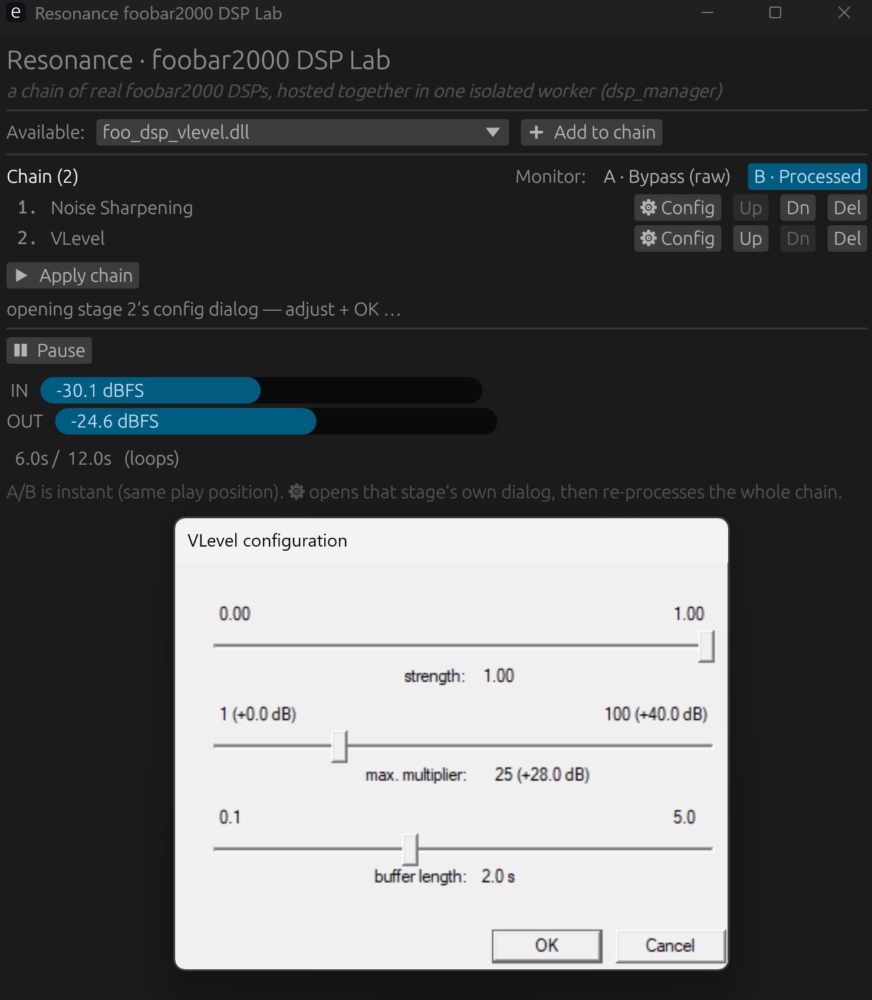

# foobar-dsp-host

**Host real foobar2000 DSP components (`foo_dsp_*`) outside of foobar2000.** Load them, **chain several
together**, stream audio through the chain, drive each plugin's *own* config dialog, and get processed
audio back. As far as I know this is the first open-source host that does this generically.

foobar2000's component model isn't a flat C ABI — it's a COM-like C++ **service** SDK, which is why
hosting its DSPs outside the player has long been considered impractical. It turns out the surface a
*DSP* actually needs is small. This repo implements it: a tiny C++ host that satisfies the foobar2000
SDK handshake, runs the plugin in an **isolated worker process**, and exposes a dead-simple stdio
protocol that any program can drive. A Rust + egui "lab" is included as a reference client.

> **Status: reference implementation.** Built for the *[Resonance](https://github.com/cwilliams5/Resonance)* media player; its long-term home and
> source of truth will live there. See [Maintenance](#maintenance).



## What works

- Loads any foobar2000 **v2 (x64)** or **v1.x (x86)** DSP component.
- Enumerates its `dsp_entry`, instantiates it, and streams **f32** audio through `dsp::run`.
- **Chains DSPs** — load several into one worker and run them in series via the SDK's own `dsp_manager`
  (one process, one pass, f32 throughout — not `.exe→.exe→.exe`). Reorder, remove, and configure each
  stage individually. See `docs/HOW-IT-WORKS.md` → *Chaining*.
- Opens the plugin's **own** Win32 config dialog and round-trips its preset blob.
- **Isolation:** the plugin runs in a separate worker process — a crash drops the pipe and the host
  survives (foobar's own VST adapter uses the same out-of-process trick).
- **x64 and x86** workers (32-bit-only components — convolvers, crossfeed, Dolby Headphone — need the
  x86 worker; a 64-bit process can't load a 32-bit DLL).
- **Remembers settings:** a DSP's config (its `dsp_preset` blob) is saved per-component and restored on
  the next load (the lab keeps these under `presets/`).

## Quick start

1. Install **Visual Studio 2022** with the Desktop C++ workload (**x64 + x86**), and **Rust** (`cargo`).
2. Drop one or more `.fb2k-component` files into **`components/`**.
3. Double-click **`run-lab.bat`**.
4. In the window: pick a DSP → **➕ Add to chain** (repeat to stack more) → reorder with **↑/↓**, drop one
   with **✕** → **▶ Apply chain** → **▶ Play** → toggle **A · Bypass / B · Processed**, and **⚙ Config** any
   stage to open its own dialog. It plays the bundled CC0 clip; drop your own `test.mp3`/`.flac`/`.wav` in
   the repo root to use that instead.

**No foobar2000 installation is required** — `shared.dll` builds from the bundled BSD SDK source.

## How it's put together

```
 your program  ── stdio protocol ──▶  foo_dsp_host.exe --worker  ── foobar2000 SDK ──▶  foo_dsp_*.dll
 (the lab, or                         (implements foobar2000_api;                       (the real
  your own host)                       hosts the plugin; x64 or x86)                      DSP plugin)
```

| Path | What |
|---|---|
| `host/` | The C++ worker. Implements the ~11-method `foobar2000_api`, links the SDK, loads a component, and speaks the protocol on stdin/stdout. The same exe is a standalone CLI (`foo_dsp_host.exe <dll>`) and the IPC worker (`--worker`). |
| `lab/` | The Rust/egui reference client — spawns the worker, decodes audio (symphonia), plays via cpal, with A/B, level meters, and config. |
| `sdk/` | The vendored foobar2000 SDK (BSD-2) + one tiny ATL-removal patch so `shared.dll` builds without the VS ATL component. |
| `docs/PROTOCOL.md` | The worker IPC protocol — the real, language-agnostic "API". |
| `docs/HOW-IT-WORKS.md` | How the foobar2000 SDK handshake is satisfied (the interesting part). |

Build manually instead of the `.bat`: `./build.ps1` (workers + `shared.dll`, both arches), then
`cargo run --manifest-path lab/Cargo.toml`.

## Compatibility

DSP compatibility is a spectrum. Effects that don't read track metadata — gain, EQ, resamplers,
levelers, exciters, stereo tools — work with a null track handle (most DSPs). A minimal `configStore`
stub satisfies plugins that read a stored default (e.g. resamplers, which would otherwise bail). Plugins
that deeply inspect the *current track* via `metadb` aren't supported (that subsystem isn't stood up).
Settings persistence covers DSPs that keep config in the preset (most, including the dialogs you'll
use); the few that stash global state in `configStore` won't persist it (the stub is pass-through).
Details in `docs/HOW-IT-WORKS.md`.

## Maintenance

This is a **reference implementation**; active development happens upstream in Resonance. It may be kept
current via an automated export or may lag behind. Issues and PRs are welcome, but canonical fixes land
upstream and flow back here.

## Licensing

- This repo's original code (host, lab, build scripts, docs): **MIT** — see `LICENSE`.
- Bundled foobar2000 SDK under `sdk/`: **BSD-2-Clause**, © Peter Pawlowski — see `sdk/sdk-license.txt`.
- Rust dependencies and full notices: **`THIRD-PARTY-NOTICES.md`**.
- foobar2000 DSP components you load are third-party and remain under their own licenses — **none are
  bundled here**.
- "foobar2000" is a trademark of its owner. This project is unaffiliated and describes compatibility only.
